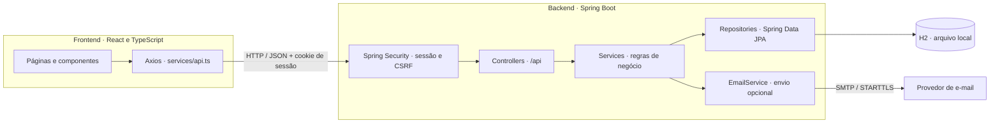
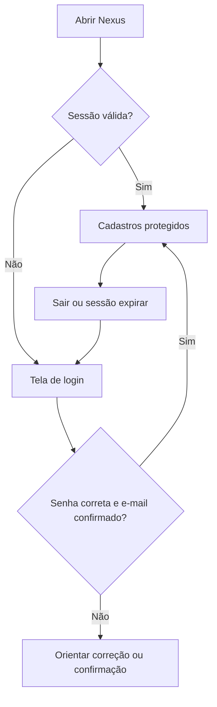
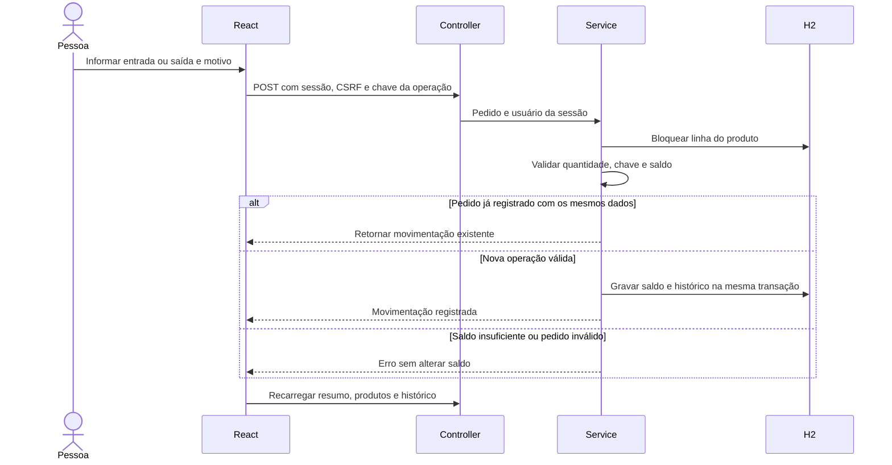
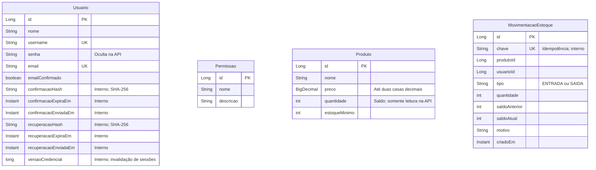
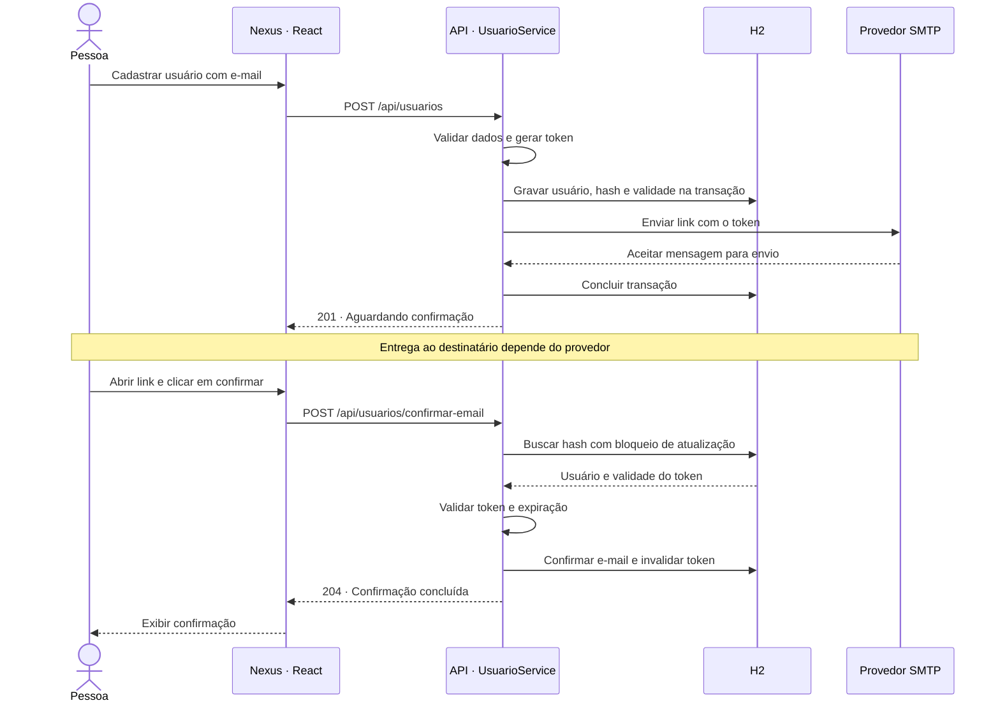
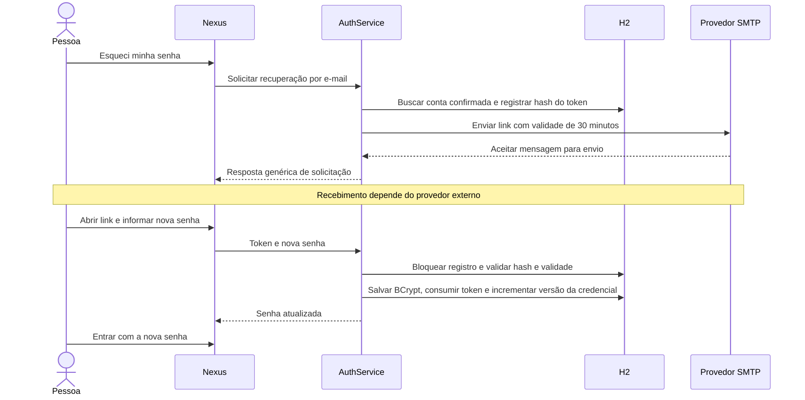

# Nexus

**Controle de estoque com cadastro de produtos, entradas, saídas e histórico de movimentações.**

Projeto de **Diego Abreu**, desenvolvido para a avaliação N1 de **Programação Web II — UEG**, com base nas Aulas 01 a 06. A interface reúne os três cadastros, com criação, consulta, edição e exclusão integradas à API e ao banco de dados.

## Funcionalidades

- Controle de saldo, entradas e saídas de produtos, histórico persistente e alertas de reposição.
- Resumo de unidades e valor do estoque ao preço cadastrado.
- CRUD completo de usuários, permissões e produtos.
- Formulários controlados, validação de campos e mensagens de erro.
- E-mail e username únicos, com normalização dos dados no servidor.
- Produtos com preço não negativo, até duas casas decimais e representação `BigDecimal` no backend.
- Persistência em arquivo H2, mantendo os registros após reiniciar a aplicação.
- Interface responsiva com identidade visual Nexus.
- Busca e ordenação nas listagens, formulário sob demanda e confirmação de exclusão com identificação do registro.
- Login com e-mail ou username e senha, exigindo confirmação do e-mail antes de acessar os cadastros.
- Sessão protegida por cookie HttpOnly, verificação no servidor e proteção CSRF nas operações de escrita.
- Recuperação de senha por e-mail com link de uso único, validade de 30 minutos e encerramento das sessões anteriores.
- Confirmação de e-mail por SMTP, quando configurado, com token de uso único e expiração em 24 horas.

## Tecnologias

| Camada | Tecnologias |
| --- | --- |
| Backend | Java 21, Spring Boot 4.1.1, Maven Wrapper, Spring Web MVC |
| Persistência | Spring Data JPA e H2; driver PostgreSQL disponível |
| Dependências adicionais | Spring Security, DevTools, Validation e Mail |
| Frontend | React, TypeScript, Vite e Axios |
| Verificação | Testes de integração HTTP, JPA e SMTP; TypeScript e Oxlint |

O `groupId` é `br.ueg.trindade`, e o pacote principal é `br.ueg.trindade.diego_web2_fullstack`. As versões das dependências estão em `pom.xml` e `src/main/frontend/package-lock.json`.

## Executar localmente

### Pré-requisitos

- JDK 21, com `JAVA_HOME` e `PATH` configurados.
- Node.js 22.12 ou superior da linha 22, ou Node.js 24, com npm.
- Internet na primeira instalação das dependências.

Maven e PostgreSQL não precisam ser instalados: o projeto inclui o Maven Wrapper e utiliza H2 por padrão.

Clone o repositório e entre na pasta:

```powershell
git clone https://github.com/Z3NYN/diegoabreu-web2-fullstack.git
cd diegoabreu-web2-fullstack
```

### 1. Iniciar o backend

Na pasta que contém `pom.xml`, execute no PowerShell:

```powershell
.\mvnw.cmd spring-boot:run
```

### 2. Iniciar o frontend

Em outro terminal, a partir da raiz do projeto:

```powershell
cd src/main/frontend
npm ci
npm run dev
```

### 3. Acessar a aplicação

Abra [http://localhost:5173](http://localhost:5173). A API utiliza `http://localhost:8080/api`. Mantenha os dois terminais em execução.

No Linux ou macOS, substitua `.\mvnw.cmd` por `./mvnw`; se necessário, conceda permissão com `chmod +x mvnw`.

O frontend utiliza a porta 5173 fixa. Se ela estiver ocupada, encerre a instância anterior. Para alterar o endereço da API, copie `src/main/frontend/.env.example` para `.env.local` e ajuste `VITE_API_URL`. Uma mudança na origem do frontend também exige ajustar o CORS no backend.

## Arquitetura



Spring Security exige autenticação para os cadastros e valida CSRF nas operações de escrita. Os controllers tratam as requisições e acessam apenas os services. Os services concentram as regras de negócio, e cada entidade possui um `JpaRepository`. No frontend, as páginas coordenam as operações e reutilizam componentes de formulário, listagem e item com dados recebidos por props.

### Acesso à plataforma

1. Configure o SMTP conforme a seção de e-mail abaixo. Sem configuração, cadastro de conta e recuperação retornam um erro explícito, sem simular entrega.
2. Na tela inicial, selecione **Criar conta** e informe nome, username, e-mail e senha com pelo menos 12 caracteres (máximo de 72 bytes).
3. Abra o link recebido e confirme o e-mail.
4. Volte ao login e entre com seu e-mail ou username e senha.

Os cadastros são acessíveis apenas após o login, inclusive quando alguém tenta chamar a API diretamente. A sessão expira após 30 minutos de inatividade; **Sair** a encerra no servidor. Senhas são armazenadas com BCrypt. Não há conta padrão nem senha de administrador incorporada ao projeto.

Contas antigas sem senha ou com senha anterior em texto simples não permitem login. Para habilitá-las, use **Não recebi a confirmação** e, após confirmar o endereço, **Esqueci minha senha**. Os registros existentes são preservados.

Se o endereço foi digitado errado no cadastro, use **Errei meu e-mail no cadastro**. Informe o username ou endereço anterior, a senha cadastrada e o e-mail correto. Essa opção atende contas ainda não confirmadas: preserva a senha, invalida o link anterior e envia uma nova confirmação. O formulário também sugere conferir domínios com erros comuns de digitação, sem alterar o endereço automaticamente.



```text
src/
├── main/
│   ├── java/br/ueg/trindade/diego_web2_fullstack/
│   │   ├── config/
│   │   ├── controller/
│   │   ├── model/
│   │   ├── repository/
│   │   └── service/
│   ├── resources/application.properties
│   └── frontend/
│       ├── public/
│       └── src/
│           ├── components/
│           ├── pages/
│           ├── services/api.ts
│           └── types/
└── test/java/
scripts/Iniciar-Com-Email.ps1
```

## API

Os recursos disponíveis são `usuarios`, `permissoes` e `produtos`.

| Método | Endpoint | Resultado |
| --- | --- | --- |
| GET | `/api/{recurso}` | Lista de registros — 200 |
| GET | `/api/{recurso}/{id}` | Registro pelo identificador — 200 |
| POST | `/api/{recurso}` | Cadastro — 201 |
| PUT | `/api/{recurso}/{id}` | Atualização — 200 |
| DELETE | `/api/{recurso}/{id}` | Exclusão, sem corpo — 204 |

Dados inválidos retornam 400; registros inexistentes, 404; conflitos de unicidade, 409. Sem sessão, os recursos protegidos retornam 401; falta de CSRF válido retorna 403. As mensagens de erro são devolvidas em JSON no campo `message`.

Exemplos de corpo para cadastro:

**Usuário**

```json
{"nome": "Ana Silva", "username": "ana.silva", "email": "ana@example.com"}
```

**Permissão**

```json
{"nome": "Consulta", "descricao": "Consultar registros"}
```

**Produto**

```json
{"nome": "Teclado", "preco": 99.90, "estoqueMinimo": 2}
```

A entidade `Usuario` contém o campo `senha`, oculto nas respostas por `@JsonIgnore`. O formulário de gestão utiliza nome, username e e-mail; este contrato preserva a senha existente durante a edição. A senha é definida pelo cadastro de conta ou pela recuperação, nunca pelos endpoints de edição do CRUD.

### Autenticação e recuperação

| Método | Endpoint | Finalidade |
| --- | --- | --- |
| GET | `/api/auth/csrf` | Obter token de segurança para uma operação de escrita |
| POST | `/api/auth/registrar` | Criar conta com `nome`, `username`, `email` e `senha` |
| POST | `/api/auth/login` | Entrar com `identificador` e `senha` |
| GET | `/api/auth/me` | Consultar a conta da sessão autenticada |
| POST | `/api/auth/logout` | Encerrar a sessão |
| POST | `/api/auth/reenviar-confirmacao` | Solicitar confirmação com `email` |
| POST | `/api/auth/corrigir-email` | Corrigir conta pendente com `identificador`, `senha` e `email` |
| POST | `/api/auth/recuperacao` | Solicitar recuperação com `email` |
| POST | `/api/auth/redefinir-senha` | Definir senha com `token` e `senha` |

As escritas exigem o token obtido de `/api/auth/csrf` no cabeçalho `X-CSRF-TOKEN` e os cookies da mesma sessão. O frontend faz isso automaticamente. Login e confirmação rotacionam ou consomem seus respectivos tokens; nenhum token de recuperação é retornado ao navegador pela solicitação de envio.

## Controle de estoque

Compatível com a proposta de funcionalidades próprias da N1 (checklist, p. 1) e de regras no Service (Aula 06, p. 21). O controle de estoque complementa a entidade própria Produto e mantém os CRUDs acadêmicos.

1. Cadastre um produto em **Produtos**, informando preço e estoque mínimo. O saldo inicial é zero.
2. Em **Estoque**, selecione o produto na tabela e registre uma **entrada**, com quantidade inteira e motivo.
3. Registre **saídas** para vendas, consumo ou outros destinos. O sistema impede quantidade superior ao saldo.
4. Consulte saldo e histórico. Saldo igual ou menor que o mínimo sinaliza reposição; saldo zero aparece como sem estoque.

Cada operação aceita 1 a 1.000.000 unidades; o saldo máximo é 1.000.000 por produto. Quantidades fracionárias e motivos vazios são rejeitados pelo servidor. O valor do resumo é quantidade × preço cadastrado, não faturamento nem custo contábil.

Movimentações são permanentes. Para corrigir um lançamento, registre uma movimentação inversa com o motivo da correção. Produtos com histórico não podem ser excluídos, mesmo com saldo zero; os demais continuam com CRUD completo. O frontend fornece uma chave UUID por operação e conserva a mesma chave ao repetir uma tentativa com os mesmos dados. Bloqueio de linha e transação garantem que saldo e histórico sejam gravados juntos, impedindo saídas concorrentes acima do saldo. Idempotência evita duplicação quando a mesma solicitação chega novamente; não agrupa operações diferentes.

| Método | Endpoint | Finalidade |
| --- | --- | --- |
| GET | `/api/estoque/resumo` | Totais e alertas de reposição |
| GET | `/api/estoque/produtos/{id}/movimentacoes` | Últimas 100 movimentações e total do histórico |
| POST | `/api/estoque/produtos/{id}/movimentacoes` | Registrar entrada ou saída |

Corpo de movimentação (o frontend gera a chave automaticamente):

```json
{"tipo":"ENTRADA","quantidade":10,"motivo":"Reposição de mercadoria","chave":"986f5135-5db8-4fbb-af3a-2ea7aa9a8040"}
```

Endpoints protegidos por sessão e CSRF. O usuário responsável é obtido da sessão, nunca do corpo enviado pelo cliente. O histórico exibe os últimos 100 registros; os anteriores permanecem no banco. Estoque é compartilhado entre usuários autenticados, com os mesmos controles de acesso dos cadastros existentes.



## Banco de dados

A configuração padrão está em `src/main/resources/application.properties`:

```properties
spring.datasource.url=jdbc:h2:file:./data/database
spring.jpa.hibernate.ddl-auto=update
```

Execute o backend sempre pela raiz do projeto para utilizar o mesmo arquivo `data/database.mv.db`. Esse banco e os artefatos de compilação ficam fora do Git. Os testes utilizam bancos em memória isolados. O console H2 permanece desativado.

### Modelo de dados

As entidades possuem identificador gerado automaticamente. Usuario, Permissao e Produto mantêm seus CRUDs. MovimentacaoEstoque registra os identificadores do produto e do usuário sem introduzir relacionamentos JPA adicionais. `Permissao` representa um cadastro acadêmico; não determina o acesso ao CRUD.



`PK` identifica a chave primária e `UK`, os campos únicos. O diagrama mostra os atributos persistidos; `statusEmail` é calculado a partir do estado de confirmação.

## Confirmação de e-mail

Esta funcionalidade adicional requer uma conta SMTP e um remetente verificado. Por padrão, o envio está desativado, e o usuário aparece como **pendente de envio**. A aplicação não simula uma confirmação entregue.

Quando habilitado, o cadastro ou a troca de endereço envia um link. O token é armazenado apenas como hash, expira em 24 horas e é invalidado após uso ou reenvio. O intervalo mínimo entre reenvios é de 60 segundos. A página solicita um clique explícito para confirmar o endereço.

### Fluxo de confirmação

O diagrama representa o caminho bem-sucedido com SMTP habilitado. A chegada da mensagem depende do provedor e da caixa de entrada do destinatário.



| Método | Endpoint | Ação |
| --- | --- | --- |
| POST | `/api/usuarios/{id}/confirmacao-email` | Enviar ou reenviar a confirmação |
| POST | `/api/usuarios/confirmar-email` | Confirmar com o corpo `{"token":"token-do-link"}` |

### Configuração com Brevo

1. Crie uma conta na Brevo, verifique o remetente e habilite o envio transacional conforme as instruções do provedor.
2. Obtenha o login SMTP e uma chave SMTP na seção SMTP & API.
3. Encerre o backend que estiver rodando e execute, na raiz:

```powershell
.\scripts\Iniciar-Com-Email.ps1
```

Na primeira execução, o script solicita a chave de forma oculta e salva a configuração em `.nexus/smtp.clixml`, fora do Git. A chave é criptografada pelo Windows para o usuário que a salvou (DPAPI); não é portável para outra conta ou computador. O backend utiliza SMTP com STARTTLS, e as variáveis de ambiente alteradas são restauradas ao encerrar. Mantenha o frontend em outro terminal. Não coloque credenciais no código, no frontend ou no Git.

Para salvar os dados antes de iniciar o backend:

```powershell
.\scripts\Iniciar-Com-Email.ps1 -Configurar -SomenteConfigurar
```

Nas próximas execuções, use o script sem parâmetros. Para substituir as credenciais, use `-Configurar`.

Outros provedores podem ser configurados com estas variáveis de ambiente:

| Variável | Finalidade |
| --- | --- |
| `NEXUS_EMAIL_ENABLED` | `true` para habilitar o envio |
| `NEXUS_EMAIL_FROM` | Endereço do remetente verificado |
| `SMTP_HOST` / `SMTP_PORT` | Servidor SMTP e porta; padrão de porta 587 |
| `SMTP_USERNAME` / `SMTP_PASSWORD` | Credenciais SMTP |
| `SMTP_AUTH` / `SMTP_STARTTLS` | Autenticação e TLS; padrão `true` |
| `NEXUS_FRONTEND_URL` | Endereço para o link; padrão `http://localhost:5173` |

O endereço `localhost` funciona apenas no computador em que a aplicação está rodando. Aceitação pelo SMTP não garante chegada à caixa de entrada. O protocolo foi testado localmente e a confirmação pela Brevo foi recebida e concluída pelo autor. Cada instalação precisa configurar suas próprias credenciais; recebimento do link de recuperação na caixa pessoal não foi verificado.

### Recuperação de senha

Em **Esqueci minha senha**, informe o e-mail confirmado da conta. O link enviado abre uma tela para definir e repetir a nova senha. O token é aleatório, armazenado como hash e expira em 30 minutos. Um novo envio invalida o link anterior; após a troca de senha, o token é consumido e as sessões anteriores deixam de permitir acesso.

Solicitações para endereços inexistentes ou ainda não confirmados recebem a mesma resposta genérica, sem divulgar quais contas existem. O envio tem intervalo mínimo de 60 segundos por conta; login é limitado a 10 tentativas por minuto por IP, e os fluxos de cadastro/recuperação/reenvio/redefinição compartilham um limite de 20 solicitações por minuto por IP. Esses limites são locais ao processo e reiniciam com o servidor.



Referência: [documentação SMTP da Brevo](https://help.brevo.com/hc/en-us/articles/7924908994450-Send-transactional-emails-using-Brevo-SMTP).

## Verificação

Na raiz:

```powershell
.\mvnw.cmd verify
```

No frontend:

```powershell
cd src/main/frontend
npm run build
npm run lint
```

Na verificação de **03/10/2026**, os **31 testes** passaram, assim como a compilação e o lint do frontend. A suíte cobre CRUD autenticado, bloqueio de operações anônimas, CSRF, senha BCrypt, login condicionado à confirmação, logout, invalidação de sessões, expiração, reenvio e consumo concorrente da recuperação, além da correção de e-mail condicionada à senha. Os dois tipos de mensagem foram enviados pelo protocolo SMTP a um servidor local de teste. O SMTP externo da Brevo também foi configurado e testado; o autor confirmou o recebimento da confirmação e a ativação da conta. O recebimento do link de recuperação na caixa pessoal não foi verificado, embora o fluxo tenha testes HTTP e SMTP aprovados. A persistência em arquivo e o CRUD das três entidades também foram verificados anteriormente com a aplicação em execução.

O projeto compila para Java 21. A execução disponível nesta auditoria utilizou JDK 22; a execução especificamente no JDK 21 ainda precisa ser confirmada.

## Escopo acadêmico

Esta entrega atende ao escopo técnico da N1: aplicação em camadas, entidade própria `Produto` e integração React → API → H2. A confirmação de e-mail é uma evolução adicional solicitada para a Nexus.

Login obrigatório, confirmação e recuperação de senha foram adicionados a pedido do autor após o escopo original da N1. A autenticação utiliza sessão no servidor, sem JWT. Todas as contas autenticadas e confirmadas podem acessar os três cadastros; o cadastro de permissões ainda não implementa perfis de autorização.

O backend permanece limitado a `127.0.0.1` por padrão. Para exposição pública, são necessários HTTPS, `SESSION_COOKIE_SECURE=true`, configuração adequada de origem/CORS e avaliação dos controles de autorização. SMTP e banco não possuem fila transacional conjunta. Upload, deploy e relacionamentos adicionais ficam fora desta entrega.

Consulte o [checklist da avaliação](CHECKLIST-N1.md) e o [relatório de auditoria](AUDITORIA.md) para as evidências e pendências. O compartilhamento do link com o professor e a avaliação do histórico de commits fazem parte da entrega acadêmica.

## Autor

**Diego Abreu** · Programação Web II · Universidade Estadual de Goiás.
