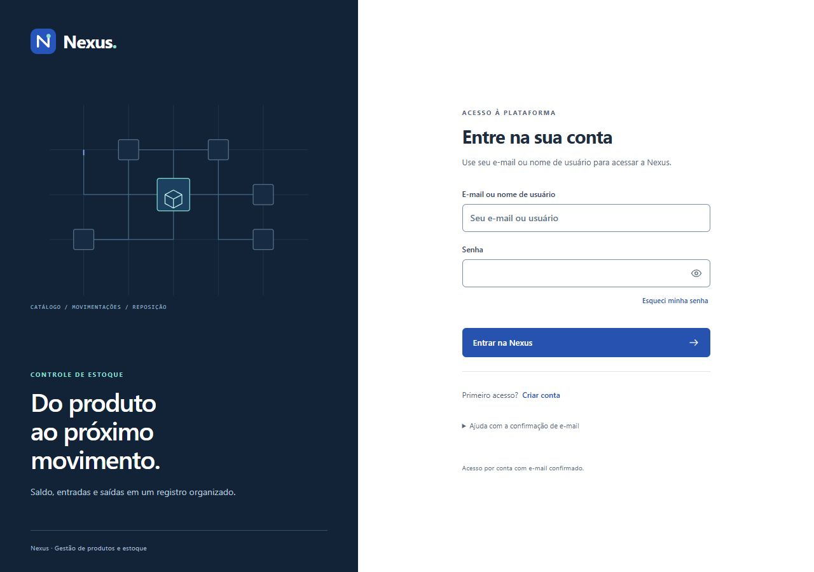
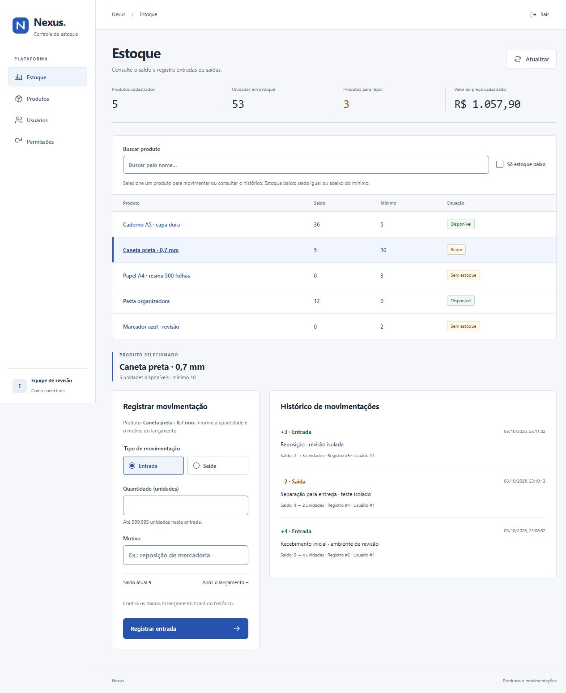
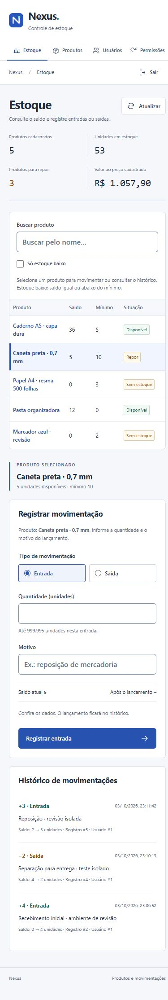

# Revisão visual e de experiência da Nexus

Revisão local concluída em 03/10/2026. A identidade usa azul, superfícies claras, tipografia do sistema e uma ilustração própria de conexões entre produtos. A área de trabalho prioriza leitura dos dados e ações de estoque.

## Alterações

- Acesso, cadastro, confirmação, correção de e-mail e recuperação compartilham a mesma composição. Campos de senha têm controle de visibilidade, orientação e estados de envio. Mensagens de falha e resultados recebem foco para facilitar o uso por teclado.
- Navegação lateral no desktop e navegação horizontal no celular, com página ativa, atalho para o conteúdo e foco após mudar de tela.
- Tabela de estoque com seleção identificada, busca, filtro de reposição, contagem dos resultados e limpeza dos filtros. Uma indicação avisa quando o produto selecionado está fora do filtro.
- Formulário de movimentação mostra produto, saldo disponível, limite da operação e saldo previsto. Após registrar, o foco volta à quantidade.
- Cadastros têm estados de carregamento, busca sem resultados e retorno do foco após salvar ou cancelar. O diálogo de exclusão inicia na ação segura, mantém o ciclo de Tab, fecha com Escape e devolve o foco.
- CSS separado em base compartilhada, acesso e área de trabalho; ícones SVG locais, sem dependências novas.

## Verificação

| Verificação | Resultado |
| --- | --- |
| Build do frontend | `npm run build`: aprovado |
| Lint do frontend | `npm run lint`: aprovado |
| Navegador | Acesso e telas de estoque, produtos, usuários, permissões, cadastro, correção, confirmação e recuperação revisados |
| Responsividade | Larguras de 320, 390, 820 e 1280 px; rolagem horizontal corrigida na menor largura |
| Estoque integrado | Entrada de 3 unidades e saída de 2; saldo, resumo e histórico atualizados pela API |
| Limites | Saída acima do saldo impedida pela validação; saída sem saldo desabilitada com orientação |
| Cadastros | Produto criado e editado na base isolada; valores da lista atualizados |
| Teclado | Atalho de conteúdo, seleção de entrada/saída por seta, foco após operações, Tab no diálogo e cancelamento por Escape conferidos |
| Autenticação | Login de conta de teste, falha de login, validação de e-mail, exibição da senha e mensagem de link inválido conferidos |
| Contraste | Pares de texto essenciais verificados com mínimo de 4,5:1; bordas dos campos e foco com mínimo de 3:1 |
| Animação | SVG com CSS, sem serviços externos; duração de 14 segundos, `pointer-events: none`; animação e ilustração desativadas no celular |

Os testes que alteram dados usaram uma instância temporária em `localhost:8081`, banco H2 separado, conta de teste e cookie de sessão próprio. SMTP ficou desativado nessa instância. A base, o servidor e os arquivos temporários foram removidos ao concluir a revisão. Os dados persistentes da aplicação principal não foram alterados, e as credenciais pessoais não foram utilizadas nos testes. O backend e as configurações de autenticação, CSRF e SMTP não foram alterados.

## Limites da revisão

A regra `prefers-reduced-motion` foi verificada no CSS e no arquivo gerado pelo build. O navegador disponível não oferece emulação dessa preferência, portanto o comportamento com a preferência do sistema ativada não foi testado diretamente. A desativação no celular foi conferida no navegador.

A entrega real de e-mail e a troca de senha de uma conta pessoal não foram repetidas nesta revisão visual. As telas foram revisadas, sem usar credenciais pessoais ou disparar e-mails de demonstração.

## Capturas finais

As telas de estoque abaixo contêm exclusivamente dados da base de testes.

